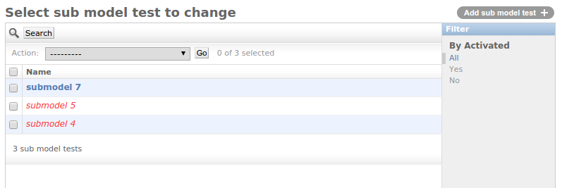

===============
Activated Mixin
===============

.. image:: https://travis-ci.org/makinacorpus/django-activated-mixin.png
    :target: https://travis-ci.org/makinacorpus/django-activated-mixin

.. image:: https://coveralls.io/repos/makinacorpus/django-activated-mixin/badge.png?branch=master
    :target: https://coveralls.io/r/makinacorpus/django-activated-mixin?branch=master

A Django model mixin allowing objects to be deactivated instead of deleted when they are protected.
This allow the information to be kept in the related object.

Quick start
-----------

1. Add "activated_mixin" to your INSTALLED_APPS settings.

2. Add the `activated_mixin.models.ActivatedMixin` mixin to your models, don't forget to set `on_delete` to `PROTECTED`::

     class MyModel(models.Model):
         related_object = models.ForeignKey('RelatedModel', on_delete=models.PROTECTED)

     class RelatedModel(ActivatedMixin):
         pass

3. Your RelatedModel objects will now be deactivated when they should be deleted if they are linked to another object.

4. To get the active objects, you can use the `actives` manager instead of the `objects` one::

   all_objects = RelatedModel.objects.all()
   active_objects = RelatedModel.actives.all()

5. Use the `GenericModelAdmin` for your model admin to highlight activated/deactivated objects::

6. You can run the tests by doing `make test`.

AUTHORS
=======

* Florent Lebreton <florent.lebreton@makina-corpus.com>
* Yann FOUILLAT (alias Gagaro) <yann.fouillat@makina-corpus.com>

|makinacom|_

.. |makinacom| image:: http://depot.makina-corpus.org/public/logo.gif
.. _makinacom:  http://www.makina-corpus.com

=======
LICENSE
=======

* GPLv3+
